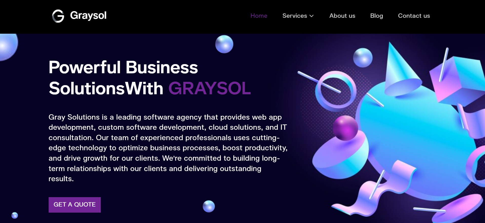

# Graysol Company Website

## Purpose

This project is the official website for Graysol, showcasing the services offered by the company, featuring a contact form for inquiries, and a blog page containing company-related posts. The website is designed to provide an easy-to-navigate interface for potential clients and partners to explore the company's offerings and get in touch.

## Project Structure

The project is built with React using Vite and Tailwind CSS for styling. The structure is organized as follows:

- **`assets/`**: Contains icons, fonts, and images used throughout the site.
- **`components/`**: Reusable components that are used across multiple pages and sections.
- **`hooks/`**: Custom hooks for managing state and logic.
- **`pages/`**: The main pages of the website, each representing a different section of the site.
- **`sections/`**: Sections within pages, implemented as JSX files.
- **`styles.js`**: Contains custom styles like font sizes, weights, and colors.
- **`App.js`**: The main application component.
- **`main.js`**: Entry point for the application.
- **`index.css` & `app.css`**: Global CSS styles.

## Installation

### Prerequisites

- Node.js
- Git

### Steps

1. **Fork the Repository:**

   ```bash
   git clone <repository-url>
   cd graysol-web-app-new
   ```

2. **Install Dependencies:**

   ```bash
   npm install
   ```

3. **Run the Development Server:**

   ```bash
   npm run dev
   ```

   The website should now be running locally on `http://localhost:5173`.

## Technical Summary

- **Styling:** Tailwind CSS is used, with custom styles defined in `styles.js` and custom classes configured in `tailwind.config.js`.
- **Data Management:** Service page data is managed in `servicedata.js` within the `components` folder.
- **Deployment:** The website is deployed on Vercel, allowing for continuous deployment and easy management of production environments.


## Homepage Sponsors Section

The Sponsors section showcases the brands and companies that have collaborated with or sponsored Graysol. This section is designed to scroll seamlessly across the screen, highlighting logos of sponsors in a continuous loop.

### Code Breakdown

```jsx
<div className="w-full">
  <div className="h-[120px] m-auto overflow-hidden relative w-auto">
    <ul className="flex h-full items-center w-[calc(150px*50)] animate-scroll ">
      {allImages.map((image, index) => (
        <li className="w-[150px] h-[100px] flex items-center" key={index}>
          
        </li>
      ))}
    </ul>
  </div>
</div>
```

### How It Works

Container (div.w-full): The outermost container spans the full width of the page, ensuring the scrolling sponsor logos take up the entire section width.

Overflow Hidden (overflow-hidden): This ensures that only the visible logos are shown, while the rest of the scrolling list remains hidden, creating a smooth scrolling effect.

Scrolling List (ul):

The ul has a flex layout that arranges all logos horizontally in a single row.
The width is calculated dynamically using w-[calc(150px * 50)], where each logo occupies 150px, and there are 50 logos (25 sponsors duplicated twice to create a seamless scrolling effect).
Animation (animate-scroll): The ul uses a custom scroll animation (defined in the Tailwind CSS configuration) to move the list of sponsor logos continuously from right to left, providing the impression of an infinite scroll.

Responsive Design
Each li contains a sponsor logo wrapped in an img tag. The size of the images is set using responsive classes like w-20, lg:w-24, and xl:w-28, which adjust based on screen size, ensuring that the layout remains responsive across different devices.
Animation Explanation
The scrolling animation moves the entire ul leftward, making the sponsor logos scroll in a continuous loop. The trick to achieving seamless scrolling is duplicating the set of logos. Once the first set of logos scrolls off-screen, the second set (which is a duplicate) immediately follows, ensuring there’s no break or jump in the scroll.
Key Points
Flexbox Layout: The flex layout ensures that all logos are aligned horizontally and centered vertically within the container.
Seamless Scrolling: By duplicating the list of logos, the scrolling effect appears continuous and seamless, providing a smooth visual experience for users.
Dynamic Width: The total width of the ul is dynamically calculated based on the number of logos, ensuring there is enough space for the scrolling effect.
This section adds a dynamic and visually engaging element to the homepage, showcasing Graysol's partners and sponsors in an interactive and professional manner.


## Acknowledgments

Special thanks to the developers and contributors of the libraries and tools used in this project, including React, Vite, and Tailwind CSS.

---

